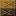

# To start server:
> node game_server.js

# Controls:
- Movement: Arrow key
- Bomb: B
- Ice trap: V
- Cheating: (Hold) spacebar

## Login page:
First register an account, then log in

## Lobby page:
Left side shows current player that are ready to join game, press the join game button to join the waitlist.

Once 4 players are all waiting to get in game, the game will start automatically.

Also, the player can log out by pressing the log out button at the top right.

## Gameplay page:
Use the controls stated above to play the game, breaking the destroyable walls  sometimes drops power up.
There are three types of power up:

-  : Increases the maximum amount of placeable ice trap.
-  : Increases the maximum amount of placeable bomb.
-  : Increases the explosion radius of both the ice trap and bomb.

When a player is caught in a bomb explosion, the character controlled by the player will die immediately.

When a player is caugh in an ice trap explosion, the character will be frozen in place, unable to move for a few seconds.

The game ends when there are zero or one player left on the playground.

## Game end page:

When the ends, relavent gameplay statistics of each player will be displayed in the game end page.

Players can then choose to log out or return to lobby page for another round.

